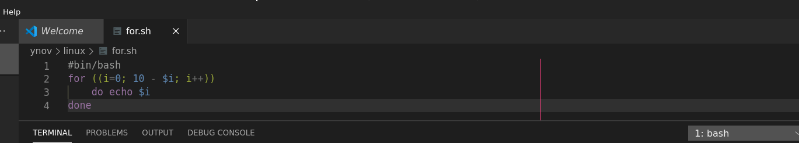
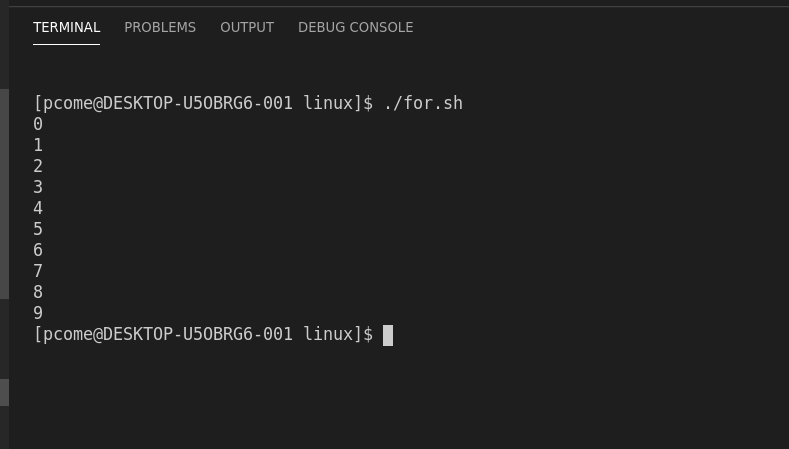

## Les Boucles en SHELL

Les boucles en bash comportent deux types les boucles **for** et les boucles **while**.

# Les boucles **for**

la boucle **for** permet de parcourir une liste d'une taille connue. La boucle for comprend trois composant l'initialisation, la condition et l'opperation.
- L'initialisation comme le nom l'indique vous devez indiquer une varible qui vous servira d'index dans la boucle.
- la condition vous permet de regler juqu'à ou votre boucle bouclera.
- l'opperation precise quel calcule la boucle doit effectuer un addition, une soustraction, une multiplication ou biens une division.

voici un petit example

Ici la boucle **for** va créer une variable **i** qui sera intialisé à 0. La boucle effectura sont operation tant que 10 - la valeur de **i** n'est pas égale à 0 et l'opperation est tout simplement **i** + 1. Mais bon on dit "qu'un act vaut mille discours" donc voilà le resultat de notre petite boucle

Et voilà! notre boulce a effectuer dix fois son opperation. Mais passons a l'interieur de notre boucle.
Comme vous avez pu le constater il y a unbout de code dans notre boucle, on peut le remarquer par son decalement par rapport au reste du code. Ce code est ce que on appele le corp de la boucle. Soit l'utiliter de votre boucle. Le corp de votre boucle sont toutes les choses que votre boucle va effectuer le nombre de fois demander. Dans notre example il affiche simplement le nombre de tours que la boucle effectue.
