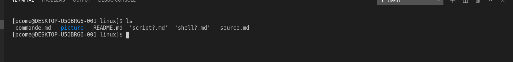
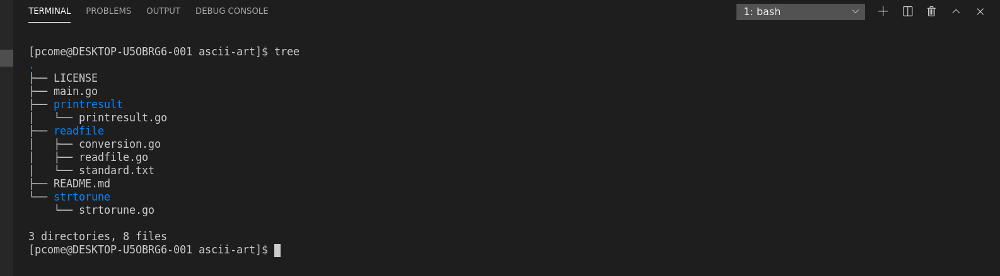
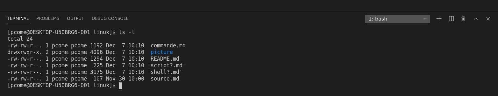

# quelques commandes en shell
nous allons voir certaine commande basique en shell qui vont nous permetre de nous deplacer dans les fichiers, en créer de nouveaux et de les modifier.

# la gestion des fichier

- mk : création d'un fichier
- mkdir : créaation d'un dossier
- mv : (moove) permet de deplacer un fichier ou dossier ou biens de le renommer
- cp : (copy) permet de copier un fichier
- rm : permet supprimer un fichier
- rmdir : pertmet de supprimer un dossier. ATTENTION le dossier doit etre vide pour etre supprimer
- cat : permet d'afficher le contenue dans fichier.
- ls : permet d'afficher tous les élèments ou vous vous trouvez.

# naviguer dans vos dossier

- pwd : vous affiche votre position actuelle
- cd : vous permet d'entre/sortir d'un dossier 
- tree : affiche tous les dossiers et les fichiers ou vous vous trouver ansi que les fichier embriquer dans les dossiers

# deux, trois dernières pour vous sauver

- ping : permet de tester la connection internet de votre machine
- man : affiche le manuel de la commande : man (commande)
- clear : efface les ligne de commande

# et pour les petits curieux
chercher cheatsheet bash commande sur internet

# pour biens finir
tout les commandes peuvent être modifier grâce à des flags qui ajoute des particularité a leurs utilisation donc penser toujours à faire un man de la commande que vous venez de decouvrir. un petit example avec ls
!

garder biens que ce n'est qu'une modification parmis tant d'autre tester les toutes par vous même pour vous familliariser avec ces commandes.

*[Retour au sommaire](./README.md)* | *[chapitre précédent](./https://github.com/lancelot260/linux/blob/main/shell%3F.md)* | *[chapitre suivant](https://github.com/lancelot260/linux/blob/main/script%3F.md)*
