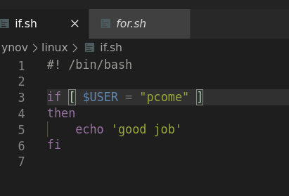
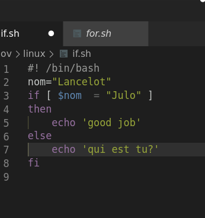
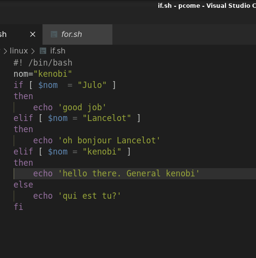

## Les conditions

Les conditons en bash sont semblables a tous les autres languages. Les conditions se font par le biais de la formulation **if**.
Les **if** sont simple d'utilisation. vous utiliser le mot clef **if** puis vous mettez la condition, puis vous metez le mot clef **then** puis l'instruction à effectuer.

Vous pouvez rajoutez un **else** pour préciser que faire si la conditions n'est pas remplie.

si vous voulez avoir plusieur cas  vous devez utilise le mot clef **elif** la nouvelle condition puis à nouveau le mot clef **then**

pensez biens a fermer votre boucle de condition avec le mot clef **fi** pour préciser la fin de votre boucle

*[Retour au sommaire](./README.md)* | *[chapitre précédent](https://github.com/lancelot260/linux/blob/main/boucles.md)* | *[chapitre suivant](hhttps://github.com/lancelot260/linux/blob/main/script%3F.md)*
