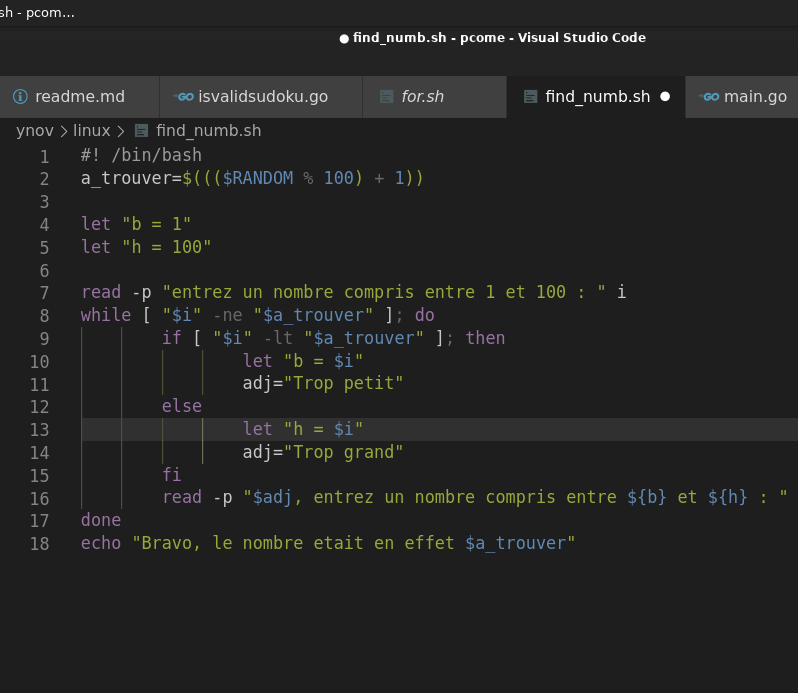
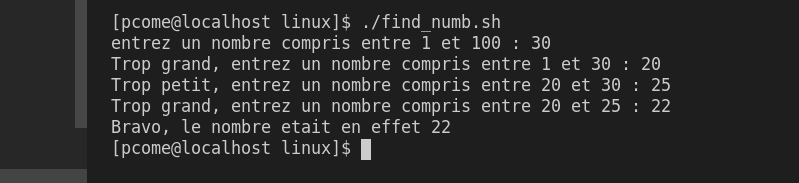

## LES SCRIPT 

## La création d'un script

La création d'un srcipt se fait grace à un fichier **.sh** pour prévenir la machine quelle devra traiter du bash.
On devrat toujours préciser le type de shell utiliser au debut du fichier avec la commande : 
`#! /bin/<le type shell utilisé>`
suite a cela vous pouvez utiliser tout type de commande que nous avons vus auparavant ce qui permet de utiliser les boucles et des conditions em même temps.

## utilité 
Les scripts sont untilisé pour automatisé des actions bassiques de tout type. Vu que les script peuvent prendre toutes les commande bash vous pouvez utiliser un script pour rendre une tache automatique allant de la simple gestion de ficheir comme par example : supprimer tous les ficher temporaire, les copies et les excutables que vous créez en lançant votre compilation de fichier. Mais on peut aussi créer un scrpit pertettant de compiler vos fichier pour vous, les scripts peuvent aussi permetrre de créer de nouveau utilisateur et de gerer leur compte. 
Les scripts peuvent aussi etre pousser plus loing, certaints scripts peuvent etre des jeux à part entiere comme une simple devinette ou veut trouver un nombre au hassard

Voilà un petit example de script simple à reproduire pour commencer. pour vous montre un exmaple plus complexe et biens plus pousser je me dois de vous montre cet extrai fait en bash :
[Star Wars](http://asciimation.co.nz/)

Oui vous ne revez pas certaine personne on refait le premier Star Wars de la trilogie originalle en bash grace a un script. Sur ce prenait des pop-corn et bon vissionage :wink:.

Et dites vous que ce n'est que quelques examples parmient un infinité. Alors à vous de jouer et de vous amuser avec du bash et de laisser libre à votre immagination et féniantise.

Et voilà pour ce court cour au bash, biens que nous somme rester sur des choses basique vous avec toutes les bases pour laisser cours a vos idées et votre talent. Passer d'exelente fête de fin d'année et 

**MAY THE FORCE BE WITH YOU**

*[Retour au sommaire](./README.md)* | *[chapitre précédent](https://github.com/lancelot260/linux/blob/main/condition.md)*
