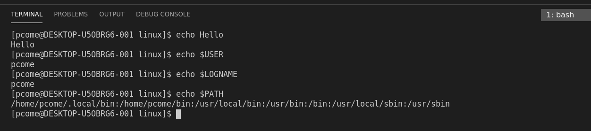

# Les variables en bash
Les variables en bash ne sont pas typer contrairment aux autres langages de programation. Mais il exite des variables particulieres:les variables d'environnements.
Les variables d'environnements sont des donnés du systeme recurable à tous moments.

# Les varibles d'environnements
- USER : Nom de l'utilisateur
- PATH : chemin d'accès au fichier bin qui contient le Shell
- LOGNAME : Nom de l'utilisateur connecté
- HOME : Répertoire home
- SHELL : Type de Shell utilisé
- PWD : Répertoire et chemin d'accès dans lequel on se trouve
- TERM_PROGRAM : Programme utilisé pour gérer le terminal
- TERM_PROGRAM_VERSION : La version du programme en question
- LANG : Langue utilisée avec son encodage
- _ : chemin d'accès à la commande printenv

# Afficher les variables
- printenv : Affiche les variables d'environnement actives
- echo $VAR : Affiche le contenu de la variable d'environnement 
- set (liste des variables paramétrées)
- env : variables exportées d'office 

On utilise le symbole **$** pour preciser que ce sont des variables.

# Exemple
- echo : permet d'imprimer l'élement donné en parametre

Echo nous print le parametre donné que ce soit une variable environnementale ou bien une variable créé de tout pièce.
Prenez du temps pour vous familiariser avec les variables d'environnemants et penser à utiliser la commande man si vous avez des doutes ou que vous voulez plus d'informations.

*[Retour au sommaire](./README.md)* | *[chapitre précédent](https://github.com/lancelot260/linux/blob/main/commande.md)* | *[chapitre suivant](https://github.com/lancelot260/linux/blob/main/script%3F.md)*
